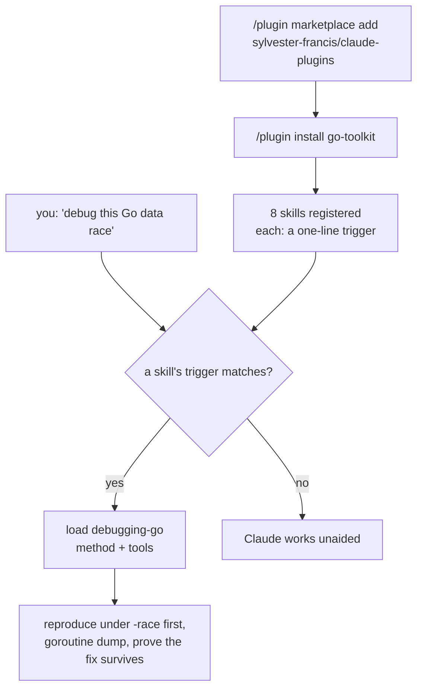
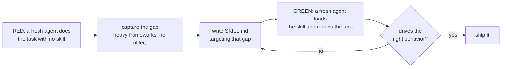

<div align="center">

<pre>
 _______ ____   ____  _      _  _______ _______ _____
|__   __/ __ \ / __ \| |    | |/ /_   _|__   __/ ____|
   | | | |  | | |  | | |    | ' /  | |    | | | (___
   | | | |  | | |  | | |    |  <   | |    | |  \___ \
   | | | |__| | |__| | |____| . \ _| |_   | |  ____) |
   |_|  \____/ \____/|______|_|\_\_____|  |_| |_____/
</pre>

### Developer-productivity plugins for Claude Code  -  Go  -  TypeScript  -  Python  -  Rust

**Install one plugin per language and Claude Code gains a fluent teammate: idiomatic scaffolding, systematic debugging, real tests, safe refactors, measured performance, hard security, production observability - plus tiered model orchestration. Every skill is independently verified against a fresh agent that loads it.**

[](https://code.claude.com/docs/en/plugins)
[](https://github.com/sylvester-francis/claude-plugins/actions/workflows/validate.yml)
[](#the-marketplace)
[](#the-toolkits)
[](LICENSE)
[](https://github.com/sylvester-francis/claude-plugins/releases)

`/plugin marketplace add sylvester-francis/claude-plugins` - one add, then install the toolkit for your language.

</div>

---

## The thirty-second pitch

A model that knows a language in general still drifts from *your* conventions:
it reaches for a heavy framework, forgets the profiler, ships an `unwrap` on user
input. These plugins pin the good defaults. Each is a Claude Code **skill** - a
short reference the model loads on its own when the task matches - so when you
scaffold a Go service or debug a hung Node process, Claude already knows the
method and the tools.

Five plugins: four per-language **toolkits** (Go, TypeScript, Python, Rust) and
one language-agnostic **model-orchestration** plugin. Install the toolkit for
your language and its eight skills trigger automatically:

```console
$ /plugin marketplace add sylvester-francis/claude-plugins
$ /plugin install go-toolkit@sylvester-plugins

# later, mid-task - the skill loads itself, no invocation:
you>    scaffold a new Go service
claude> [loads scaffolding-go-projects] cmd/ + internal/, no /pkg, staticcheck
        + doc-check, deployments/ for Docker ...   # your conventions, not generic
```

Nothing here is generic advice. Every skill was written the way you'd test code:
run a **fresh agent with no skill** to see what it does by default (the gap),
write the skill to close that gap, then run a **second fresh agent that loads the
skill** and confirm it drives the right behavior.

## The marketplace

Five plugins under one marketplace (`sylvester-plugins`):

| Plugin | Skills | For |
|---|---|---|
| **go-toolkit** | scaffolding - debugging - testing - refactoring - performance - security - observability - orchestration | Go services, CLIs, libraries |
| **typescript-toolkit** | scaffolding - debugging - testing - refactoring - performance - security - observability - orchestration | Node / NestJS apps, npm libraries |
| **python-toolkit** | scaffolding - debugging - testing - refactoring - performance - security - observability - orchestration | FastAPI / Django services, PyPI libraries |
| **rust-toolkit** | scaffolding - debugging - testing - refactoring - performance - security - observability - orchestration | axum / tokio services, crates |
| **model-orchestration** | tiered-model-orchestration | any language or task |

Each language toolkit bundles the same eight skills, specialized to that
language's tools and idioms; the orchestration skill also ships standalone for
work outside those four languages.

## Install

Add the marketplace once, then install what you need:

```sh
/plugin marketplace add sylvester-francis/claude-plugins

/plugin install go-toolkit@sylvester-plugins
/plugin install typescript-toolkit@sylvester-plugins
/plugin install python-toolkit@sylvester-plugins
/plugin install rust-toolkit@sylvester-plugins
/plugin install model-orchestration@sylvester-plugins
```

Skills are namespaced per plugin and trigger on their description - you do not
call them by hand. The name in the `@` suffix is the marketplace, `sylvester-plugins`
(the repository is `claude-plugins`).

## How it works

A plugin is a folder of skills. A skill is a `SKILL.md` with a front-matter
`description` that says *when* to use it; Claude reads that one line in the
background and loads the full skill only when your task matches. Until then the
cost is a single line of context.



## How each skill was built

The same loop for all of them - test-driven development, applied to
documentation:



The result is skills grounded in observed behavior, not vibes: `scaffolding-go`
avoids the `/pkg` trap because the baseline fell into it; `security-*` leads with
authorization/IDOR because that is what actually ships broken; `performance-*` is
measure-first because unguided agents guess.

## The toolkits

Every language toolkit ships these eight skills (names are language-suffixed,
e.g. `debugging-go`, `debugging-typescript`, `debugging-python`, `debugging-rust`):

| Skill | What it covers |
|---|---|
| **scaffolding** | project layout, build/deps, lint, types, test setup, packaging - application vs. library |
| **debugging** | a root-cause method plus the language's tools: race detectors, `py-spy`/`tokio-console`, CPU/heap profiles, source maps |
| **testing** | table/parametrized tests, fakes over mocks, HTTP tests, coverage, property-based tests |
| **refactoring** | idioms, anti-patterns, type-safety, and reviewing a diff without changing behavior |
| **performance** | measure-first profiling and the specific fixes; when to reach for parallelism |
| **security** | authz/IDOR, input validation, injection, auth, SSRF, and the language's footguns + CVE scanners |
| **observability** | structured logs, RED metrics, OpenTelemetry tracing, correlation IDs, health/readiness - wired at the edges |
| **tiered-model-orchestration** | plan (Opus, max) -> execute (Sonnet) -> cross-verify (Haiku/Sonnet), independently |

Anchored on each language's real tooling:

- **Go** - `staticcheck`, `-race`, pprof, `gremlins`, `govulncheck`/`gosec`, `slog`, and golang-standards/project-layout (adopted, not blindly).
- **TypeScript** - strict `tsconfig`, `vitest`/`jest`, clinic/`--cpu-prof`, `pino` + OpenTelemetry, NestJS conventions, and the `exports` map.
- **Python** - `uv`, `ruff`, `mypy --strict`, `pytest`/Hypothesis, `py-spy`/`cProfile`, `structlog`, `bandit`/`pip-audit`.
- **Rust** - `cargo`, `clippy -D warnings`, `criterion`/`cargo flamegraph`, `tracing`/`tokio-console`, `thiserror`/`anyhow`, `cargo audit`/`deny`.

## model-orchestration (standalone)

`tiered-model-orchestration`, on its own for any language or task: route a
substantial job across model tiers - **plan with Opus at max effort, execute with
Sonnet, cross-verify with an independent Haiku/Sonnet pass** that tries to refute
the result against the plan's acceptance checks, looping on failure. The same
skill is also bundled inside each language toolkit.

## Validation

Every push and pull request runs `claude plugin validate . --strict` (a local,
no-auth check) plus a dependency-free JSON structural gate, so a malformed
manifest can never land. See
[`.github/workflows/validate.yml`](.github/workflows/validate.yml).

## Repository layout

```
claude-plugins/
  .claude-plugin/marketplace.json     the marketplace: lists the five plugins
  plugins/
    go-toolkit/                       .claude-plugin/plugin.json + skills/<name>/SKILL.md
    typescript-toolkit/
    python-toolkit/
    rust-toolkit/
    model-orchestration/
  .github/workflows/validate.yml      CI: claude plugin validate --strict
  LICENSE
```

## Author

Created and maintained by [Sylvester Francis](https://github.com/sylvester-francis).

## License

[Apache License 2.0](LICENSE).
